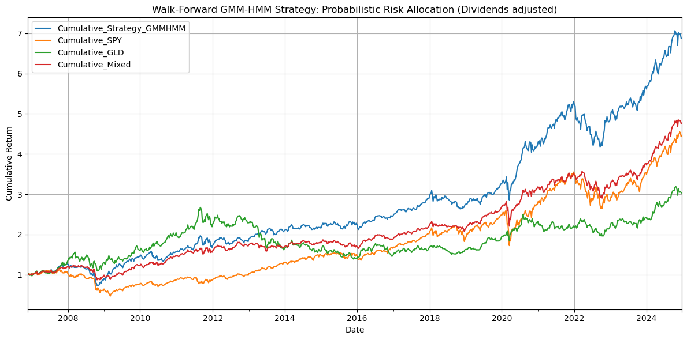

# Regime-Aware SPY / GLD Allocation with Hidden Markov Models

Probabilistic tactical allocation between US equities (SPY) and Gold (GLD) using rolling Hidden Markov Models (HMM). The notebook implements and compares:

1. Gaussian HMM (2 latent regimes) on weekly SPY returns.
2. GMM-HMM (mixture emissions) to capture fat tails and multi‑modality.
3. Bivariate GMM-HMM adding a realized volatility feature.
4. Dividend / total-return benchmark comparison using `^SP500TR`.

Goal: Improve drawdown profile and risk-adjusted returns (Sharpe) versus long-only SPY and a naive 50/50 static SPY/GLD blend, while retaining interpretability (two macro regimes: risk‑on vs risk‑off).

---

## Core Idea
Equity returns are generated by latent market regimes. If we can infer the probability of transitioning into / being in a stressed regime, we can size a defensive allocation (GLD) proportionally to that probability instead of binary switching. This smooth hedge aims to cut downside while preserving compounding.

---

## Simplifying Assumptions 

* Risk‑free rate assumed 0 for Sharpe 
* Zero transaction costs, slippage, and market impact 
* Dividend timing approximated via `^SP500TR` proxy, assumes negligible tracking difference vs true SPY total return.

---

## Results
- Outperformed static 50/50 SPY–GLD benchmark with +2.2% CAGR and +6.6% Sharpe ratio improvement, indicating superior risk-adjusted returns.
- Reduced drawdowns vs SPY benchmark, achieving –15.3% max drawdown and –6.7% average drawdown, improving downside protection.
- Mixture-based univariate HMM proved most effective, capturing regime shifts and enhancing drawdown efficiency.
- Multivariate extension (adding rolling volatility) did not produce incremental performance gains.
- Dividend-adjusted total return benchmarks confirmed robustness of results, ruling out distortions from ignoring equity income.

### Walk-Forward Performance



<sub>Figure: Cumulative returns for the probabilistic SPY/GLD allocation vs SPY, GLD, and a static 50/50 mix. Dividends/total return adjusted where applicable.</sub>

---
## Quick Start
Clone & install (recommend Python 3.10+):

```bash
git clone https://github.com/tommasoravasio/HMM-SPY-GLD-Strategy.git
cd HMM-SPY-GLD-Strategy
python -m venv .venv
source .venv/bin/activate  # Windows: .venv\Scripts\activate
pip install -r requirements.txt
```

Open `hmm_strategy.ipynb` and run all cells. First run will download and cache data into `data/`.

---
## Final Model Summary: Univariate GMM-HMM

| Aspect        | Choice                  | Rationale                                                        |
|---------------|------------------------|------------------------------------------------------------------|
| Regimes       | 2                      | Allows interpretability with two clear risk-on and risk-off regimea |
| Window        | 104 weeks              | Provides enough history for robust regime detection while remaining responsive to market changes. |
| Emissions     | GMM (n_mix=3)          | Captures fat tails and skew in SPY returns |
| Features      | Weekly SPY returns      | Simple and avoids noise from additional features.           |
| Allocation    | Prob    | Sizes GLD allocation proportional to regime probability.     |


---
## Contributing & Contact

*This is a personal research project. Contributions are welcome. Feel free to fork, open PRs, or suggest improvements. For questions and collaboration, you can reach out here on Github, or via mail or Linkedin.*


